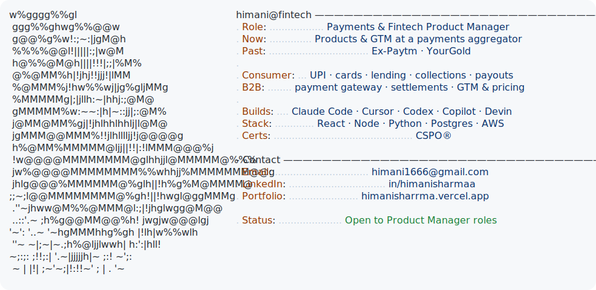

  <picture>
    <source media="(prefers-color-scheme: dark)" srcset="./assets/intro-card-dark.svg">
    
  </picture>

 

<h1 align="center">Hi, I'm Himani Sharma</h1>
<h3 align="center">Payments & Fintech PM</h3>

  Consumer-fintech roots at Paytm, product ownership at SabPaisa, now building with AI.

  🌐 <b>Live portfolio</b> → <a href="https://himanisharrma.vercel.app"><b>himanisharrma.vercel.app</b></a>

  
  
  
  

---

### About me

I'm a payments and fintech product manager. At Paytm I worked across UPI (P2M and P2P), lending and co-branded cards. As a Product Associate at SabPaisa, a payments aggregator, I shipped from spec to launch, took new products to market, and contributed to the annual operating plan.

---

### What I do

| | |
|---|---|
| 💳 **Payments & Fintech** — consumer & B2B | UPI & payments · lending & cards · collections & payouts |
| 🛠️ **Builds with AI** | I use AI to turn product ideas into working software I can test and ship |
| 📈 **Commercial & Growth** | market research, GTM, pricing & positioning (the SabPaisa 3.0 launch) |
| 🔁 **Reconciliation & Settlement** | PayOps — a self-built control room: match, net-settle, exception states |

---

### Experience

| When | Role | What I did |
|---|---|---|
| **2025 – now** | Product Associate · **SabPaisa** (payments aggregator) | Product delivery, GTM and partner-bank pitches for the 3.0 payments launch. Shipped the platform's first merchant **re-verification** flow, frontend and backend, live to **~135 merchants** and cutting re-verification turnaround **from weeks to days** — with a **configurable risk trigger** so policy can change without an engineering cycle. |
| **2025** | Product Associate (freelance) · **YourGold** | Integrated Cashfree's UPI gateway for live gold buy/sell and **payout** flows — onboarding, verification and error-recovery for reliable disbursements. |
| **2021 – 24** | Product Operations Associate · **Paytm** | 10+ products — Postpaid, Personal Loans, co-branded Cards; key role in the **UPI rollout** (P2M online & offline, and P2P). Data-driven enhancements lifting **productivity ~93%** and **quality ~96%**. R&R award. |

<i>In the press: <a href="https://www.tribuneindia.com/news/business/sabpaisa-shatters-records-with-14-product-launch-in-single-day-powered-by-ai-human-collaboration/">SabPaisa's AI-first 14-product launch →</a></i>

---

### Selected work

<i>Payments products, built end-to-end. Feature highlights, not line counts.</i>

| Project | What it is | Highlights |
|---|---|---|
| [**PayOps Copilot**](https://github.com/himanisharrma/payops-copilot) | Reconciliation & settlement control room — matches orders, gateway exports and bank settlements, nets settlement after fees & GST, sorts every order into six states | 88 tests · 18 migrations · AI-bounded |
| [**Identity Verification Platform**](https://github.com/himanisharrma/Identity-Verification-Amazon-Rekognition) | Video identity verification for merchant onboarding — liveness, face-match, maker-checker, full audit trail | Live face-match · agent review · approver flow |
| [**Customer Onboarding Portal**](https://github.com/himanisharrma/re-kyc-with-landing-page) | Full-stack merchant onboarding & re-verification — multi-role workflow, configurable triggers | 5-role workflow · trigger-config · React + Node |
| [**Compliance Intelligence**](https://github.com/himanisharrma/rekyc-compliance-module) | Grounded Q&A over the RBI KYC rules — hybrid retrieval, cited answers, eval-gated | Hybrid retrieval · 12-case eval · cited answers |
| [**FinVerge Sales Skills**](https://github.com/himanisharrma/finverge-sales-skills) | A Claude Code plugin automating GTM collateral over a permission-aware knowledge base | 8 skills · permission-aware KB · GTM tooling |
| [**Agentic Verification (MCP)**](https://github.com/himanisharrma/video-kyc-hackathon) | A 6-tool MCP server for assisted verification — safety gates, PII-masked at the boundary | 6 tools · safety gates · PII-masked |

<i>Full case studies & diagrams → <a href="https://himanisharrma.vercel.app">himanisharrma.vercel.app</a> · <a href="https://github.com/himanisharrma/portfolio">portfolio hub</a></i>

---

### How I build with AI

<i>Working knowledge — my day-to-day AI toolkit. My rule: <b>AI assists · rules decide · humans approve · logs prove.</b></i>

**Engineering stack**

  

**Agentic AI**

  
  
  
  
  
  
  
  
  
  
  
  
  
  
  
  
  
  
  

<b>Full toolkit</b>

| Layer | Tools |
|---|---|
| 🧠 LLMs & research | Claude · ChatGPT · Gemini · Perplexity · Grok · NotebookLM · M365 Copilot · open-weights (Llama / Mistral / DeepSeek) |
| 💻 Coding & agents | Claude Code · Cowork · Cursor · Windsurf · GitHub Copilot · OpenAI Codex · Replit · Devin · Claude computer-use · OpenAI Operator · Browser Use |
| ⚡ Build & prototype | Bolt · Lovable · v0 · Google AI Studio · Figma Make · Galileo AI · Uizard · Framer AI · Remotion |
| 🔗 Agent engineering | MCP (I build servers) · RAG + evals · structured outputs · prompt caching · LangChain · CrewAI · Flowise · n8n · Zapier · Make · Supabase |
| 📋 PM · docs · design | Notion AI · Jira · Linear · Confluence (Rovo) · Productboard · ChatPRD · Figma · FigJam / Miro · Whimsical · Napkin AI · Mermaid |
| 📊 Data · notes · research | ChatGPT Advanced Data Analysis · Claude analysis tool · vision-OCR · Otter · Fireflies |
| 🎨 Multimodal & cloud | AWS Rekognition / Textract / Comprehend · Midjourney / DALL·E / Ideogram · Runway / Pika / Kling / Veo · HeyGen / Synthesia · ElevenLabs |

---

  💬 <b>Let's talk payments.</b> 
  Open to PM roles · Delhi NCR · Bangalore · Remote · <a href="mailto:himani1666@gmail.com">himani1666@gmail.com</a>

